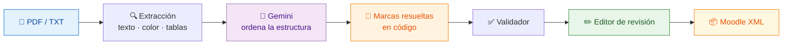

<div align="center">


# Conversor a Moodle XML

### De un examen en PDF a un banco de preguntas de Moodle, en un par de clics

[](https://www.python.org/)
[](https://fastapi.tiangolo.com/)
[](https://aistudio.google.com/)
[](https://docs.moodle.org/en/Moodle_XML_format)


</div>

---

Convierte pruebas, cuestionarios y exámenes (**PDF** o **TXT**) en un archivo **Moodle XML Question Format** listo para importar. Corre como una app de escritorio nativa en Windows y macOS — **no hace falta saber nada técnico para usarla**.

> [!IMPORTANT]
> El sistema **nunca inventa ni resuelve una respuesta**. Solo lee las que ya están en el documento (la clave final o las marcas del propio examen). Si una pregunta no tiene respuesta indicada, la señala y bloquea el XML hasta que la completes.

<div align="center">



</div>

---

## ✨ Características principales

<table>
<tr>
<td width="50%" valign="top">

### 🎯 Lectura fiel del examen

- **7 tipos de pregunta Moodle**: opción múltiple, verdadero/falso, emparejamiento, completar (Cloze), ensayo, respuesta corta y numérica.
- **Respuestas múltiples** en opción múltiple y en cada espacio de un Cloze.
- **Marcas leídas del PDF, no adivinadas**: color, resaltado, subrayado, negrita, ✓ y cuadros con X — resueltas **en código**, no por la IA.
- **PDF escaneados**: "Leer el PDF con IA" lee las páginas como imagen (hasta 15).
- **Rechaza lo que no es un examen**: si suben una presentación, un manual o un artículo, lo dice claro en vez de inventar preguntas.

</td>
<td width="50%" valign="top">

### ✏️ Revisión antes de generar

- **Mapa del examen** siempre a la vista: la pregunta actual, las **incompletas en rojo** y las que conviene mirar con **borde ámbar discontinuo**. *Generar XML* no avanza mientras haya incompletas.
- **La primera pregunta a la vista**: avisos en una línea y herramientas plegadas (Mostrar por tipo · Puntos); *Añadir pregunta* va al final.
- **Nada se pierde**: *Deshacer* al borrar una pregunta o repartir puntos, la revisión **se guarda sola** (*Retomar revisión* al volver a abrir la app), *Volver a la revisión* desde la pantalla final y *Descartar* con confirmación.
- **Atajos de teclado**: <kbd>J</kbd>/<kbd>K</kbd> siguiente/anterior, <kbd>I</kbd> siguiente incompleta, <kbd>R</kbd> siguiente para revisar, <kbd>?</kbd> abre la guía.
- **Constructor visual de Cloze**: sin escribir corchetes a mano.
- **Progreso en vivo**: avance real de la subida del archivo, por qué pregunta va la IA y cuánto falta (se puede cancelar).
- **Historial local** con **buscador** (nombre, categoría o fecha): cada XML se vuelve a descargar o se **reabre** en el editor para corregirlo.
- **API de Gemini propia**: la primera vez, un paso de bienvenida explica cómo obtener la clave gratis en Google AI Studio, la comprueba con Google y la guarda **cifrada** en el equipo (Mac y Windows). Se cambia o se quita desde *API de Gemini*.
- **Accesible**: foco atrapado en las ventanas, contraste AA, anuncios para lector de pantalla y "reducir movimiento".

</td>
</tr>
</table>

> [!NOTE]
> **Privacidad:** el documento se procesa en tu equipo. A Google solo se envía lo necesario para ordenar las preguntas — el texto extraído y, cuando hace falta, imágenes de algunas páginas (código en captura, marcas dentro de una imagen, o un PDF escaneado). Ningún otro dato sale de tu máquina.

---

## 🚀 Uso para el usuario final

```
1️⃣  Descarga o clona el proyecto
2️⃣  Doble clic en iniciar.command (macOS) o iniciar.bat (Windows)
3️⃣  La primera vez instala todo solo (unos minutos); después abre directo
4️⃣  La primera vez pega tu clave de la API de Gemini (gratis; la app explica cómo obtenerla)
5️⃣  Sube el examen → revisa las preguntas → descarga el .xml
```

En Moodle: **Banco de preguntas → Importar**.

> [!TIP]
> ¿Quieres un instalador de verdad, sin que el usuario final necesite Python?
> · **Windows** → [`ejecutable/LEEME_WINDOWS.txt`](ejecutable/LEEME_WINDOWS.txt) (`Setup.exe` con ícono, acceso directo y desinstalador)
> · **macOS** → [`ejecutable_mac/LEEME_MAC.txt`](ejecutable_mac/LEEME_MAC.txt) (`.dmg` que se arrastra a Aplicaciones)
> En ambos casos corre antes `dev/sync_ejecutable.py`. La app **no trae ninguna API key**: al abrirla por primera vez pide la del usuario (ver "La API de Gemini").

---

## 📊 Qué tan bien funciona

Set de regresión de **18 documentos** (13 sintéticos con verdad exacta por construcción + 5 exámenes reales), cada uno procesado 3 veces.

<div align="center">

| | Base | Texto + enriquecido | JSON + enriquecido | **Configuración actual** |
|:---|:---:|:---:|:---:|:---:|
| 🧪 **Sintéticos** (271 preguntas) | 87 % | 98 % | 99–100 % | **✅ 100 %** |
| 📄 **Reales** (153 preguntas) | 96 % | 95 % | 96 % | **✅ 96 %** |
| 🎲 Varianza entre corridas | sí | no | no | **no** |

</div>

**Exactitud** = preguntas que llegan al editor con el tipo, el enunciado completo **y** la respuesta correctos. Varios exámenes sintéticos traen a propósito claves *incorrectas* (ej. Saturno como el planeta más grande) para detectar si el modelo resuelve en vez de transcribir. Detalle por documento en [`dev/eval_results/RESULTADOS.md`](dev/eval_results/RESULTADOS.md).

<details>
<summary><b>⏱️ Dónde se va el tiempo</b> (medido, no estimado)</summary>

<br>

El trabajo local (abrir el PDF, extraer texto, color y tablas) tarda entre **0,6 y 2,9 s** — un 3–5 % del total. Todo lo demás es la llamada a la IA, y su duración depende casi exclusivamente de **cuánto texto escribe el modelo**, a un ritmo constante de ~350 tokens/s:

| Documento | Preguntas | Tokens de salida | Tiempo |
|---|---:|---:|---:|
| s10 estrés | 150 | 20 034 | 57 s |
| real Parcial 1 2026 | 55 | 14 871 | 40 s |
| real parcial n.1 | 40 | 10 744 | 27 s |
| real Historia/Geografía | 15 | 2 885 | 9 s |

Las excepciones a esa línea recta son esperas por **saturación del servicio** en el plan gratuito (503 "high demand"), que pueden añadir hasta 50 s aunque el examen sea de 3 preguntas. No es el documento ni el código: es la cuota.

</details>

<details>
<summary><b>🥊 Puesto a prueba con exámenes hechos para romperlo</b></summary>

<br>

Aparte del set de regresión, hay **13 exámenes sintéticos adversariales** (30–50 preguntas cada uno, 517 en total) diseñados a propósito para atacar un punto débil distinto: numeración caótica, 10 estilos de rótulo de opción distintos, clave final en 3 formatos mezclados, marcas de color a propósito ambiguas (o mezclando color/resaltado/subrayado/negrita en el mismo examen), texto en dos columnas, ruido documental (encabezados, marcas de agua, pasajes de lectura), respuestas numéricas escritas en palabras, caracteres que chocan con la sintaxis interna (`| / = ]`), Cloze con código (`arr[0]`), un escaneado degradado y un examen donde falta la mayoría de las respuestas.

**Resultado: 94 % (487/517)** — sin inventar ninguna respuesta. El único punto débil real es el **escaneado degradado** (72 %): sin capa de texto extraíble, el modelo puede "corregir" una marca de color con su propio conocimiento en vez de transcribirla, y ahí no hay lector en código que lo blindee (decisión consciente: no es el fuerte de la app). Con una IA perfecta (`dev/xml_fidelity.py`, sin usar la API), el generador de XML es **100 % fiel (517/517)**.

Detalle completo, incluida la clasificación de cada fallo por causa, en la sección "Pruebas adversariales" de [`RESULTADOS.md`](dev/eval_results/RESULTADOS.md).

</details>

---

## 🏗️ Arquitectura

```
Backend    FastAPI + Uvicorn en 127.0.0.1, todo el trabajo pesado en threadpool
Streaming  NDJSON (una línea JSON por evento) para el progreso en vivo
IA         Gemini por REST + SSE con requests — sin el SDK de Google
Frontend   Módulos ES que el navegador carga tal cual, sin npm ni compilación
Escritorio pywebview envuelve el backend local en una ventana nativa
Empaquetado PyInstaller → .exe + Inno Setup (Windows) · .app + .dmg (macOS)
```

<details>
<summary><b>📁 Estructura del proyecto</b> (desplegar)</summary>

<br>

```
Conversor a Moodle XML/
├── iniciar.command       ← Doble clic para abrir la app en macOS
├── iniciar.bat           ← Doble clic para abrir la app en Windows
├── launcher.py           ← Punto de entrada de escritorio (splash + pywebview)
├── build.py              ← Empaqueta la app como ejecutable (PyInstaller)
│
├── backend/
│   ├── main.py           ← API FastAPI (endpoints)
│   ├── config.py         ← Configuración centralizada + prompt del sistema (IA)
│   ├── credenciales.py   ← Clave de la API de Gemini, cifrada en clave.dat
│   ├── extractor.py      ← Extracción de texto (.pdf / .txt)
│   ├── pipeline.py       ← Flujo completo (lo usan la API y dev/eval.py)
│   ├── formatter.py      ← Llamada a Gemini (modo texto o JSON con esquema)
│   ├── parser.py         ← Lee el formato de texto que devuelve la IA
│   ├── schema_adapter.py ← Convierte la salida JSON de la IA
│   ├── mark_resolver.py  ← Decide en código las respuestas marcadas
│   ├── validator.py      ← Validación contra el spec Moodle XML
│   ├── xml_builder.py    ← Generación del XML Moodle
│   ├── database.py       ← Historial de conversiones (SQLite)
│   ├── models.py         ← Modelos Pydantic
│   ├── requirements.txt  ← Dependencias Python
│   └── venv/             ← Entorno virtual (no versionado)
│
├── frontend/             ← Interfaz web (sin framework ni compilación)
│   ├── index.html        ← Estructura de la página
│   ├── pruebas.html      ← Pruebas de la lógica pura (no se empaqueta)
│   ├── css/              ← base (tokens, reset) · componentes · editor
│   ├── img/icono.png     ← Ícono oficial (de assets/Icon.ico): cabecera, favicon y splash
│   └── js/               ← Módulos ES
│       ├── app.js        ← Entrada: conecta eventos y publica lo que usa el HTML
│       ├── estado.js     ← Estado compartido + avisos (suscribir/notificar)
│       ├── dom.js, util.js
│       ├── carga.js      ← Elegir el examen y leer el progreso en vivo
│       ├── subida.js     ← Envío con avance real de la subida (XMLHttpRequest)
│       ├── borrador.js   ← La revisión se guarda sola y se puede retomar
│       ├── progreso.js   ← Pantalla de carga y tiempo estimado
│       ├── puntos.js     ← Reparto del puntaje (lógica pura, con pruebas)
│       ├── validacion.js ← Qué le falta a una pregunta (con pruebas)
│       ├── resultado.js, historial.js, navegacion.js
│       ├── editor/       ← tarjetas · panel · filtros · paneles · cloze · puntos-ui
│       └── ui/           ← tema · toast (con Deshacer) · modales (foco atrapado) · confirmar · clave
│
├── assets/Icon.ico       ← Ícono oficial de la app (ejecutable, instalador y UI)
├── errores.log           ← Trazas de errores inesperados (se crea solo, no versionado)
├── data/exams_history.db ← Historial (se crea solo, no versionado)
├── docs/                 ← Referencia del spec Moodle XML
│
├── samples/
│   ├── *.pdf / *.txt     ← Exámenes reales de prueba
│   ├── synthetic/        ← Exámenes sintéticos (generados por dev/synthetic/)
│   └── golden/           ← Resultado esperado de cada uno (set de regresión)
│
├── dev/                  ← Solo desarrollo (no va en el instalador)
│   ├── eval.py           ← Evaluación contra samples/golden/
│   ├── compare.py        ← Compara resultados de eval.py lado a lado
│   ├── synthetic/        ← Generador de los exámenes sintéticos
│   ├── eval_results/     ← Resultados guardados (ver RESULTADOS.md)
│   ├── sync_ejecutable.py ← Copia el código actual a ejecutable*/ 
│   ├── list_models.py    ← Modelos de Gemini disponibles para la API key
│   └── create_exam_pdf.py, run_test.py, test_webview.py
│
├── ejecutable/           ← Instalador de Windows
│   ├── backend/ frontend/ assets/ launcher.py  ← copia (dev/sync_ejecutable.py)
│   ├── build.py           ← compila el .exe con PyInstaller
│   ├── installer.iss      ← script de Inno Setup
│   ├── build_windows.bat  ← un doble clic que hace todo el proceso
│   └── LEEME_WINDOWS.txt
│
└── ejecutable_mac/       ← Lo mismo para macOS (.app + .dmg)
    ├── backend/ frontend/ assets/ launcher.py
    ├── build.py · build_mac.sh · LEEME_MAC.txt
```

</details>

---

## 👩‍💻 Para desarrolladores

<details open>
<summary><b>Puesta en marcha</b></summary>

<br>

```bash
# 1. Entorno virtual
cd backend
python -m venv venv

# 2. Activarlo
source venv/bin/activate          # macOS / Linux
.\venv\Scripts\Activate.ps1       # Windows (PowerShell)

# 3. Dependencias
pip install -r requirements.txt
pip install pywebview             # solo para la app de escritorio

# 4. Backend
uvicorn main:app --reload --port 8000
```

| | |
|---|---|
| 🌐 App | `http://localhost:8000` — el backend sirve el frontend |
| 📚 Swagger | `http://localhost:8000/docs` |
| 🧪 Pruebas del frontend | `http://localhost:8000/static/pruebas.html` |
| 🖥️ App de escritorio | `python launcher.py` desde la raíz |

</details>

<details>
<summary><b>Evaluar cambios en la normalización</b></summary>

<br>

> [!WARNING]
> Antes de tocar el prompt, el modelo o la extracción, **corre el set de regresión**. Es la única forma de saber si un cambio que suena bien empeora la exactitud.

```bash
backend/venv/bin/python dev/eval.py                    # 18 documentos × 3 corridas
backend/venv/bin/python dev/eval.py --only s02 s05     # solo algunos
backend/venv/bin/python dev/eval.py --runs 1           # rápido, sin medir varianza
backend/venv/bin/python dev/eval.py --mode json        # probar el modo JSON
backend/venv/bin/python dev/compare.py dev/eval_results/A.json dev/eval_results/B.json
```

Además: `dev/synthetic/generate_adversarial.py` crea 13 exámenes hostiles (`--only x`), `dev/xml_fidelity.py` mide el XML con una IA perfecta y `dev/test_casos_borde.py` prueba sin API los casos que rompían el XML (ver la sección "Pruebas adversariales" de [`RESULTADOS.md`](dev/eval_results/RESULTADOS.md)).

Cómo se mide: [`dev/eval.py`](dev/eval.py) · formato del golden: [`samples/golden/README.md`](samples/golden/README.md) · resultados: [`dev/eval_results/RESULTADOS.md`](dev/eval_results/RESULTADOS.md).

</details>

<details>
<summary><b>Notas sobre el frontend</b></summary>

<br>

Sin framework y sin `npm`: son **módulos ES** que el navegador carga directamente, así que editar y recargar alcanza — no hay paso de compilación que mantener ni que recordar antes de generar el instalador.

El estado compartido vive en [`js/estado.js`](frontend/js/estado.js), que avisa con `notificar()` cuando el examen cambia; las vistas derivadas (chips de filtro, mapa de preguntas, contador de puntos) se **suscriben** en `app.js` en vez de refrescarse a mano desde cada sitio.

La lógica que no toca el DOM (`puntos.js`, `validacion.js`) tiene pruebas en `frontend/pruebas.html`: se abren en el navegador y dicen en el momento cuántas pasan.

</details>

---

## 📄 Formato esperado del examen

El documento puede subirse en **cualquier formato razonable** (numeración con `1.`, `1)`, respuestas marcadas con ✓, claves de emparejamiento compactas…) — el prefiltro de IA lo normaliza al formato interno antes de procesarlo:

```text
Pregunta 1:
¿Cuál es la definición de interfaz de usuario?
A. El espacio de contacto entre usuario y sistema
B. Un componente de software únicamente
C. Un protocolo de red
D. Una base de datos relacional

Pregunta 4:
Enunciado con un espacio así: [A: opción_correcta / opción2 / opción3]

RESPUESTAS
Nº  Tipo         Respuesta correcta
1   multichoice  El espacio de contacto entre usuario y sistema
2   truefalse    Verdadero
3   matching     1-a; 2-b; 3-c
4   cloze        A. opción_correcta
```

### Tipos de pregunta soportados

| Tipo | Formato en RESPUESTAS |
|------|----------------------|
| 🔘 `multichoice` | Texto completo de la opción correcta. Varias a la vez → sepáralas con `" \| "` (ej. `Opción B \| Opción D`). |
| ✔️ `truefalse` | `Verdadero` o `Falso` |
| 🔗 `matching` | Pares compactos `número-letra`, ej. `1-a; 2-b; 3-c` |
| 🧩 `cloze` | Un espacio: `A. opción_correcta` · Varios: `A. resp_A; B. resp_B` · Varias correctas en un espacio: `A. opción1 \| opción3` |
| 📝 `essay` · ✍️ `shortanswer` · 🔢 `numerical` | Según el spec Moodle XML |

Las preguntas **cloze** usan corchetes en el cuerpo, con letras correlativas si hay más de un espacio: `[A: opción1 / opción2] … [B: opción1 / opción2]`. El orden dentro de los corchetes no importa — la correcta se identifica por su texto, no por su posición.

> [!CAUTION]
> Si una pregunta no tiene respuesta indicada explícitamente en el original, el sistema la marca como `SIN_RESPUESTA` y **bloquea la generación del XML** hasta corregirla, para no importar a Moodle una clave inventada.

---

## 🔌 Endpoints de la API

| Método | Ruta | Qué hace |
|:---|:---|:---|
| `POST` | `/api/check_special_cases` | Avisa si el PDF trae imágenes incrustadas, antes de convertir |
| `POST` | `/api/parse` | Sube `.pdf`/`.txt`, lo normaliza y devuelve las preguntas parseadas y validadas |
| `POST` | `/api/parse_stream` | Igual, pero con progreso en vivo (NDJSON) — es lo que usa la interfaz |
| `POST` | `/api/normalize_with_ai` | Camino para PDF escaneados (lee las páginas como imagen) |
| `POST` | `/api/normalize_with_ai_stream` | Igual, con progreso en vivo |
| `POST` | `/api/generate_xml` | Recibe las preguntas (editadas o no) y devuelve el Moodle XML final |
| `GET` | `/api/history` | Últimos 300 exámenes convertidos (solo metadatos; el buscador filtra sobre esta lista) |
| `GET` | `/api/history/{id}/download` | Vuelve a descargar el XML de una conversión anterior |
| `GET` | `/api/history/{id}/editor` | Preguntas tal como quedaron en el editor, para *Reabrir* esa revisión |
| `DELETE` | `/api/history/{id}` | Borra una entrada del historial |
| `GET` | `/api/api-key` | Si hay clave de la API de Gemini guardada (solo sus 4 últimos caracteres, nunca la clave) |
| `POST` | `/api/api-key` | Comprueba la clave con Google (sin costo) y la guarda cifrada; reemplaza la anterior si la había |
| `DELETE` | `/api/api-key` | Quita la clave de este equipo |

<details>
<summary><b>Detalle de respuestas</b></summary>

<br>

**`/api/parse`** — `200`: `{ filename, questions, answer_key, was_reformatted }` · `422`: `{"detail": {"message": "...", "errors": [...]}}`, incluido el caso de un documento que no parece una prueba.

**Los `_stream`** devuelven una línea JSON por evento:
```json
{"type": "stage",    "key": "ai", "message": "…"}
{"type": "progress", "done": 12, "expected": 40}
{"type": "result",   "data": {…}}
{"type": "error",    "status": 503, "detail": "…"}
```

**`/api/generate_xml`** — descarga del `.xml`, con el header `X-Question-Stats` (JSON con conteo por tipo y puntajes calculados). El nombre del archivo va en `Content-Disposition` con `filename*=UTF-8''…` (RFC 6266): así sirven nombres con tildes o ñ, incluidos los que macOS entrega en forma descompuesta (NFD).

**`/api/api-key`** — solo acepta peticiones de la propia app (mismo origen): otra página abierta en el navegador no puede cambiarla ni borrarla, aunque el CORS general sea abierto.

**Errores inesperados** — un fallo no previsto al procesar se **reintenta una vez** solo; si se repite, el mensaje trae el detalle técnico y la ruta de `errores.log`.

</details>

---

## 🤖 El prefiltro de IA

Usa **Gemini 3.1 Flash Lite** para normalizar la *estructura* de los documentos — nunca para resolver ni inventar respuestas.

### Las marcas se leen, no se adivinan

En un PDF digital, `extract_text()` pierde justo las marcas de respuesta más comunes: el color de una opción, el resaltado, el subrayado, la negrita y la columna de la "X" en un cuadro. Sin ellas el modelo tiende a **resolver** la pregunta con su propio conocimiento. Por eso:

1. **El texto que recibe el modelo lleva las marcas anotadas** — `⟦rojo⟧Lista (list)⟦/rojo⟧`, `⟦resaltado⟧…`, `⟦subrayado⟧…`, `⟦negrita⟧…` — y las tablas con su estructura (`| Evento | … | x |`).
2. **`mark_resolver.py` decide en código** cuáles son las respuestas marcadas; el modelo solo estructura (qué es enunciado, qué es opción). También resuelve verdadero/falso marcado (`( X ) Verdadero`, o la palabra en color) y **marcas mezcladas**: un docente que subraya en una pregunta, resalta en otra y pone negrita en la siguiente igual queda cubierto.
3. **Una marca se aplica solo si funciona como sistema de respuestas**: algunas opciones marcadas (no todas), en al menos 2 preguntas y el 30 % de las ubicadas. Así la negrita de los títulos no reemplaza la clave.
4. **El editor dice de dónde salió cada respuesta**: un aviso corto arriba, la etiqueta **respuesta por marca** en esas preguntas y **revisar marca** donde la IA tuvo que interpretar.

### Configuración (variables de entorno o `.env`)

| Variable | Por defecto | Qué hace |
|---|:---:|---|
| `GEMINI_API_KEY` | — | Solo para desarrollo: la app usa la clave que el usuario pega al abrirla (guardada cifrada en `clave.dat`, que tiene prioridad). Ver `.env.example` |
| `GEMINI_MODEL` | `gemini-3.1-flash-lite` | Modelo de Gemini. Sirve para comparar modelos con `dev/eval.py` sin tocar el código (ver la comparación con 3.5-flash-lite en [`RESULTADOS.md`](dev/eval_results/RESULTADOS.md)) |
| `ENRICH_PDF_TEXT` | `1` | Marcas (color, resaltado, subrayado, negrita, tablas) anotadas y resueltas en código |
| `NORMALIZER_MODE` | `json` | Carga normal. `json`: la IA devuelve JSON con esquema (más fiel) · `text`: formato propio (2–5× más rápido) |
| `NORMALIZER_MODE_AI` | `text` | Botón "Leer el PDF con IA" (escaneados), donde el modo texto midió mejor |

### Qué pasa en cada situación

| Situación | Acción |
|---|---|
| ✅ El documento **ya tiene** el formato estándar | Gemini lo devuelve sin cambios significativos |
| 🔧 El documento **no tiene** el formato estándar | Reformatea **solo la estructura**, conservando preguntas y respuestas tal cual |
| 🚫 El documento **no es una prueba** | Responde con un centinela interno (`NO_ES_UNA_PRUEBA`); el backend devuelve `422` sin generar nada |
| ❓ Una pregunta **no tiene respuesta marcada** | Se marca `SIN_RESPUESTA` — se bloquea el XML en vez de adivinar |
| 🔌 La API **no está disponible** | 3 reintentos (10 s entre intentos); una llamada colgada se corta (180 s en texto, 300 s en JSON) |
| ⏳ **Límite por minuto** (429) | Espera lo que indica Google y reintenta |
| 🔥 Modelo **saturado** (503 "high demand") | Espera creciente (5, 10, 20, 30, 30 s); la pantalla muestra "reintentando en N s" y aclara que no es culpa del documento |
| ✂️ La respuesta **llega cortada** | Se detecta (sin `finishReason`) y se reintenta, en vez de fallar como JSON malformado |
| 🛑 **Cuota diaria agotada** | Avisa de inmediato, sin reintentar |

---

## 📦 Dependencias

```
fastapi==0.115.12          pdfplumber==0.11.6         requests>=2.31
uvicorn[standard]==0.34.2  lxml>=5.3.2                Pillow>=10.0
python-multipart==0.0.20   pydantic>=2.11.3           cryptography>=42
```

> [!NOTE]
> La llamada a Gemini va **directo contra su API REST** con `requests` (streaming SSE), sin el SDK de Google: el SDK no entregaba la respuesta por partes (sin eso no hay progreso en vivo) y sumaba decenas de MB al ejecutable (`grpc`, `protobuf`…).

Además: `pywebview` para la app de escritorio (fuera de `requirements.txt` porque el backend solo no la necesita) y `dev/requirements-dev.txt` para `dev/eval.py` y los exámenes sintéticos.

---

## 🛠️ Solución de problemas

<details>
<summary><b>El instalador de Windows se queda pegado en la pantalla de carga</b></summary>

<br>

El `.exe` de PyInstaller usa `--noconsole`: si uvicorn falla al arrancar, la app no muestra ningún error y se queda en la splash para siempre. Por eso `launcher.py` escribe cualquier fallo en un archivo **`launcher_error.log`**, junto al `.exe`, dentro de la carpeta donde quedó instalada la app. **Revísalo primero.**

**Causa más común:** un módulo que usa `backend/` (fastapi, uvicorn, sqlite3…) no quedó incluido en el `.exe`. PyInstaller trata `backend/` como datos copiados tal cual (vía `--add-data`), no como código que analiza, así que **no detecta sus imports** — hay que declararlos a mano con `--hidden-import` o `--collect-all` en [`ejecutable/build.py`](ejecutable/build.py) (y en [`build.py`](build.py)) y recompilar.

**Otra causa:** haber armado el instalador con una copia vieja del código. `ejecutable/` y `ejecutable_mac/` llevan su propia copia de `backend/`, `frontend/` y `launcher.py`; antes de compilar corre:

```bash
backend/venv/bin/python dev/sync_ejecutable.py
```

</details>

<details>
<summary><b>Aparece "Ocurrió un error inesperado"</b></summary>

<br>

Todo error no previsto queda con su traza completa en **`errores.log`**:

- Desde el código: en la raíz del proyecto.
- App instalada en macOS: `~/Library/Application Support/ConversorMoodleXML/errores.log`
- App instalada en Windows: `%LOCALAPPDATA%\ConversorMoodleXML\errores.log`

El mismo mensaje de error muestra la ruta. Ese archivo es lo primero que hay que mirar (o enviar) para saber la causa exacta.

</details>

<details>
<summary><b>La API de Gemini (pedirla, cambiarla, dónde queda)</b></summary>

<br>

La app **no trae ninguna API key incluida**: cada usuario usa la suya. La primera vez que se abre aparece un paso de bienvenida que explica cómo obtenerla **gratis** en [Google AI Studio](https://aistudio.google.com/apikey), con un botón que abre la página directo. La clave se **comprueba con Google** antes de guardarse (listar modelos: no gasta tokens) y queda **cifrada** en la carpeta de datos de la app:

- macOS: `~/Library/Application Support/ConversorMoodleXML/clave.dat`
- Windows: `%LOCALAPPDATA%\ConversorMoodleXML\clave.dat`

Cifrado Fernet (AES + HMAC) con una llave derivada del identificador de **ese equipo y ese usuario** (más una sal al azar): copiado a otra computadora, el archivo no sirve. No se guarda un hash porque la app necesita la clave tal cual para llamar a Google. No se usa el Llavero de macOS porque, con una app sin firma de desarrollador, pediría permiso después de cada actualización.

Desde **API de Gemini**, arriba a la derecha, se pega una clave nueva (reemplaza la anterior solo si Google la acepta) o se quita. Si el archivo no se puede descifrar (otro equipo, cambio de placa), la app simplemente vuelve a pedir la clave.

Las instalaciones anteriores que tenían la clave en texto plano en `…/ConversorMoodleXML/.env` la **cifran solas** en `clave.dat` al abrir la versión nueva, y la línea del `.env` queda vacía.

Desde el código, un `.env` en la raíz del proyecto con `GEMINI_API_KEY=` sigue sirviendo para desarrollo (ver [`.env.example`](.env.example)).

</details>

<details>
<summary><b>La conversión tarda mucho o dice "reintentando"</b></summary>

<br>

El tiempo depende de cuántas preguntas tenga que escribir la IA (~350 tokens/s): un examen de 15 preguntas tarda ~9 s y uno de 150, ~57 s. Si aparece "reintentando en N s", el modelo está **saturado del lado de Google** — pasa en el plan gratuito y el sistema se recupera solo esperando. No es un problema del documento.

</details>

---

<div align="center">

### Créditos

Desarrollado por **César González** y **Vicente Urriola**

</div>
